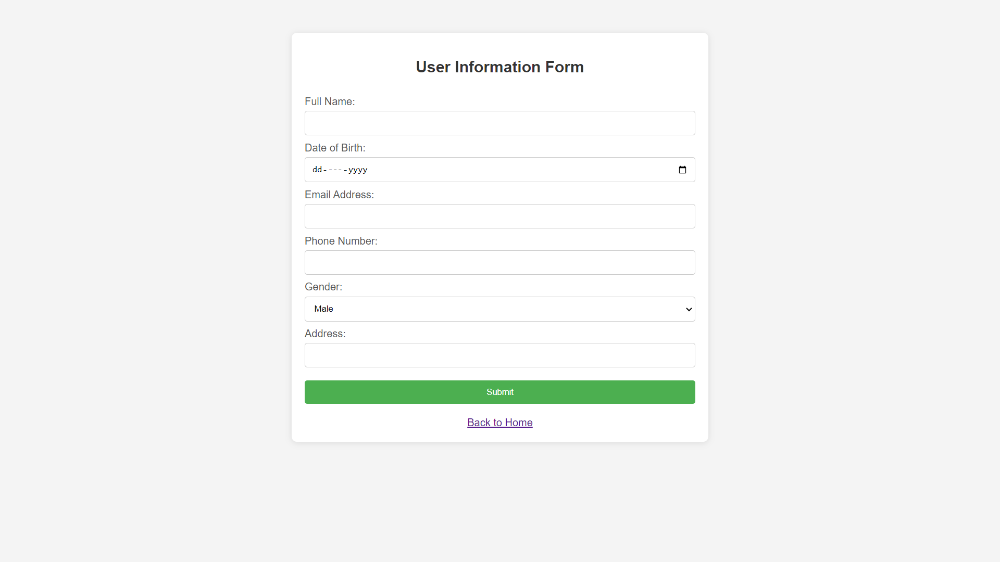
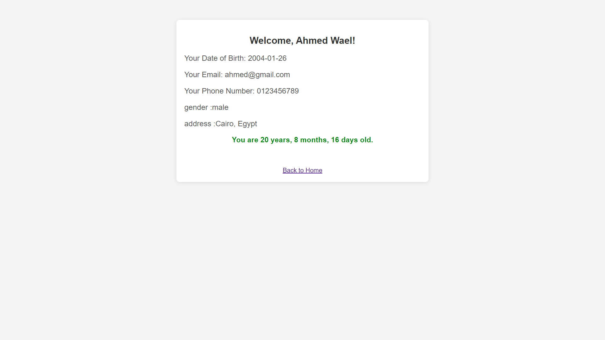

# User Information Form - Flask Project

This project is a simple web application built using **Flask** that collects user information through a form, calculates the user's age based on their date of birth, and displays the information on a result page.

## Features

- A **home page** with a welcome message and a button that directs the user to the form.
- A **user information form** that collects:
  - Full name
  - Date of birth
  - Email address
  - Phone number
  - Gender
  - Address
- **Age calculation** in the format of years, months, and days, displayed dynamically using JavaScript.
- A **result page** that displays the user's submitted information and calculated age.
- Links to navigate between the pages.

## Technologies Used

- **Flask**: A lightweight WSGI web application framework for Python.
- **HTML/CSS**: For the front-end layout and styling.
- **JavaScript**: For calculating the user's age on the result page.
- **Python**: Backend logic for routing and form handling.

## Setup and Installation

### Prerequisites

- Python 3.x installed on your system.
- Basic understanding of Flask.

### Installation

1. Clone the repository:

   ```bash
   git clone https://github.com/shadow9-1-1/User-Information-Form.git
   ```

2. Navigate to the project directory:

   ```bash
   cd User-Information-Form
   ```

3. Create a virtual environment:

   ```bash
   python -m venv venv
   ```


4. Install the required dependencies:

   ```bash
   pip install flask
   ```

5. Run the Flask app:

   ```bash
   python app.py
   ```

6. Open a browser and navigate to `http://localhost:5000/`.


## How It Works

1. **Home Page**: The user lands on the home page, which has a button that redirects them to the form page.
2. **Form Page**: The user fills out the form with their information.
3. **Result Page**: The form submission is handled, and the user is taken to the result page, where their information is displayed along with their age in years, months, and days (calculated via JavaScript).
   
   - **Age Calculation**: The user's age is calculated by comparing the date of birth with the current date using JavaScript. The result is displayed dynamically on the page.

## Screenshots

### Home Page


### Form Page


### Result Page


## License

This project is open-source and available under the [MIT License](LICENSE).
